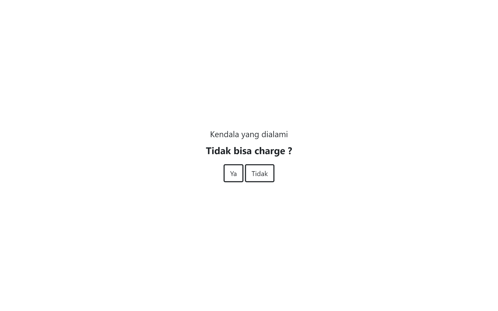
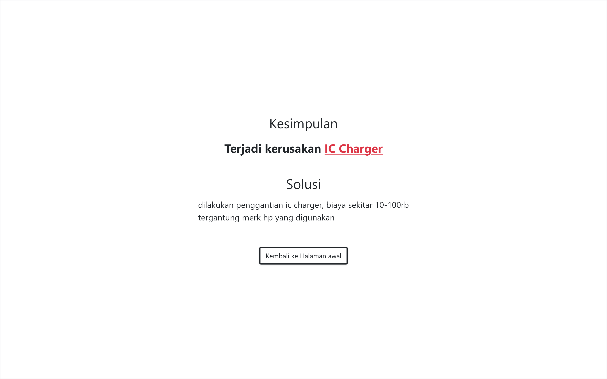
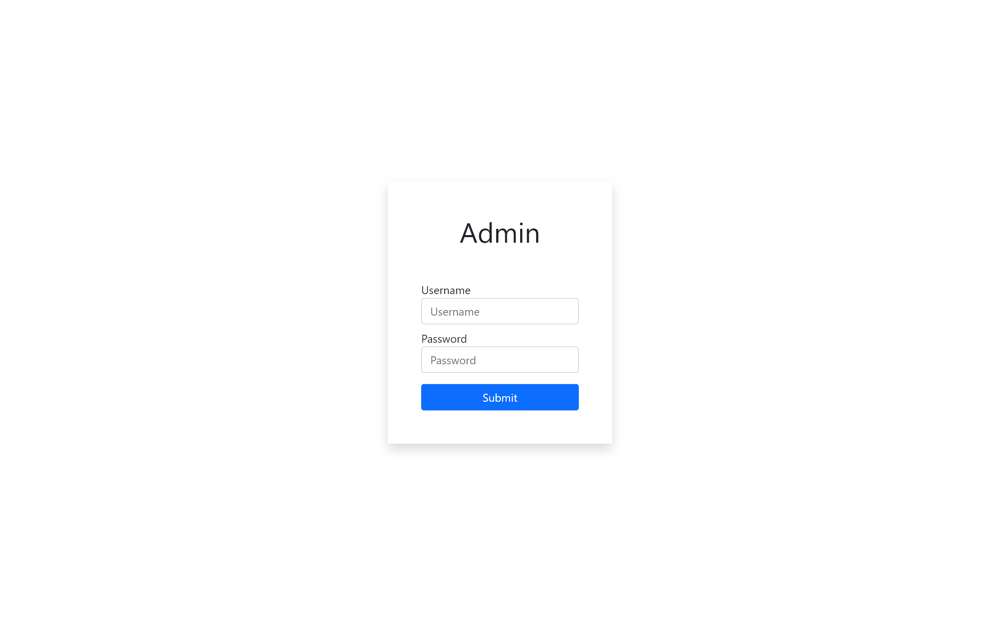
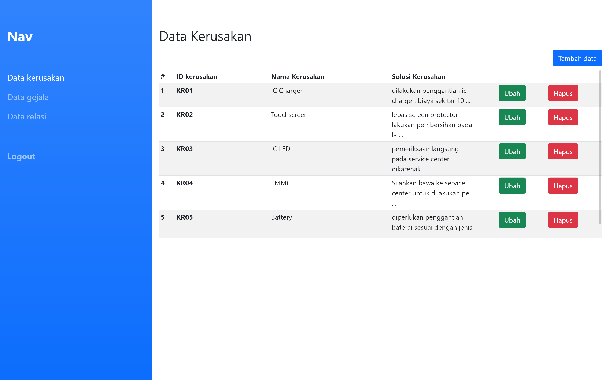
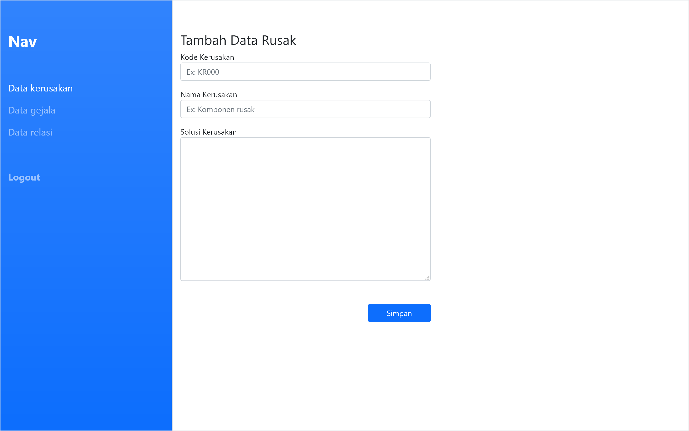

## Sistem pakar - Deteksi kerusakan Hp

dibuat dengan menggunakan NodeJs, Express, EJS, MySQL, Bootstrap
untuk keperluan tugas kuliah

##Halaman Utama

##Halaman Admin

Route Admin
###/Auth (Login)
username: admin
password: admin

###/admin (dashboard)
Data Kerusakan
Data Gejala
Data relasi
